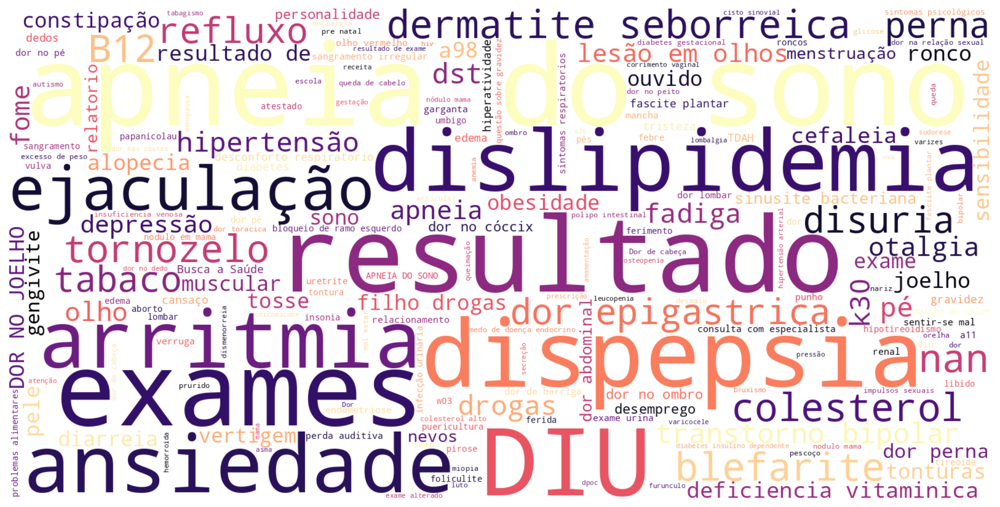

# International Classification of Primary Care (ICPC-2) and search engines: an exploration of three algorithms for information retrieval to aid medical coding


 
This repository contains the data and code for the study "International Classification of Primary Care (ICPC-2) and search engines: an exploration of three algorithms for information retrieval to aid medical coding" published at the **Journal of Medical Artificial Intelligence**. The full article is available **[here](https://dx.doi.org/10.21037/jmai-24-341)**.

## How to use this repository

In order to reproduce the results of this study, you will need clone this repository and a have few resources available:
- Approximatelly 11.0 GB of free disk space
- A local vector database with all the data
- API keys to have access to private embedding models, including OpenAI, Cohere and Gemini

Since the setup of the vector database can take several hours and may have some cost due to API services, a compressed file `vector_database.zip` with the vector database is available for download in this [link](https://drive.google.com/file/d/1lxIq420rg5RQyMFUlxbwtosUuLGR139g/view?usp=sharing). All you need to do is download the file and extract its contents at the root directory of this repository. 

## How to get your own API keys

First, you will need to have an account in each one of the organizations and get an API key for each one. Below are the relevant links for this step.
- [OpenAI](https://platform.openai.com/)
- [Gemini](https://makersuite.google.com/)
- [Cohere](https://cohere.com/)

After that, fill up the `.env` file with your API keys, as the example below:
```
OPENAI_API_KEY=<------------------YOUR-OPENAI-API-KEY-HERE--------------------->
COHERE_API_KEY=<------------------YOUR-COHERE-API-KEY-HERE--------------------->
GEMINI_API_KEY=<------------------YOUR-GEMINI-API-KEY-HERE--------------------->
```

## Reproducing the study results

All of the study results are available in the 'results' folder. If you want to generate these files yourself, all you need to do is:
1. setup a virtual environment with Python 3.11 or greater and install the requirements from 'requirements.txt'.
2. run the following to generate the results from each tested algorithm. This command will build the vector database if it is not available at the root directory. If that is the case, it may take several hours to complete. After that, it retrieves the results for each query in the query history and save them in the `queries_results.csv` file in the `results` folder.
```
python retrieve.py
```
3. run the following to compute the information retrieval metrics and graphs. The results are saved in the `results` folder.
```
python eval.py
```
4. run the following to compute the statistical analysis.
```
python stats.py
```

## Data files
In the `data` folder, there are six files.
- `thesaurus.xls`: the original ICPC-2 Brazilian Portuguese thesaurus used to construct the corpus of the search engines evaluated in our study.
- `extended_thesaurus.csv`: the corpus used to develop the search engines. 
- `icpc-2_partial.csv`: the ICPC-2 with codes and corresponding titles in Brazilian Portuguse.
- `query_history.csv`: unique expressions queried in the search engine during the study period.
- `query_value_counts.csv`: unique expressions with their value counts. This was used to weight the computed metrics with the query frequency.
- `eval_dataset.csv`: contains the selected queries, each reviewer annotation and the selected codes after discussion and consensus between reviewers in the `relevant_results` column.
